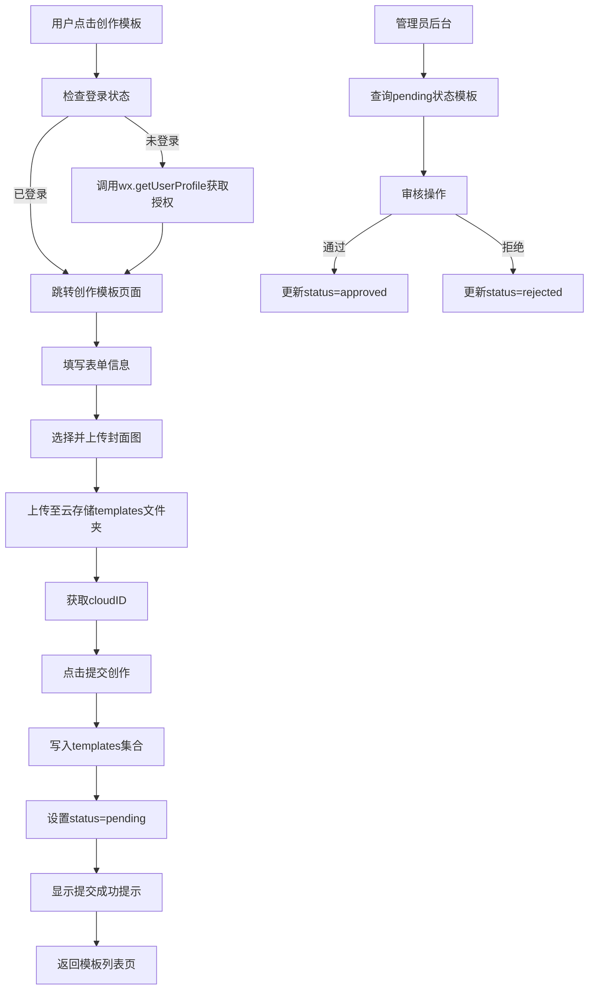

# 创作模板功能技术方案设计

## 1. 技术架构概览

本功能基于微信小程序 + CloudBase云开发架构，采用前端表单收集、云存储上传、云数据库存储的标准流程。



## 2. 数据库设计

### 2.1 templates集合现状分析

当前templates集合已有3条官方模板数据，字段结构如下：

```javascript
{
  _id: "a5016600698856910143448518deafe3",
  _openid: "自动添加", // CloudBase自动字段
  allowUserUpload: true,
  category: "景区主题",
  cover: "cloud://cultural-tourism-7fb138kf77a2cb2.6375-cultural-tourism-7fb138kf77a2cb2-1400488372/templates/ancient-town.jpg",
  creatorId: "system",
  creatorName: "官方",
  description: "探索千年艺术宝库的神秘与魅力",
  isOfficial: true,
  likeCount: 2456,
  name: "敦煌莫高窟主题",
  photoSetCount: 128,
  sort: 1,
  status: "active", // 官方模板使用active
  tags: ["文化", "历史", "艺术"]
}
```

### 2.2 用户创作模板字段设计

用户创作的模板需要新增以下字段：

```javascript
{
  _id: "自动生成",
  _openid: "用户openid(CloudBase自动)",
  name: "模板名称(1-20字)",
  description: "模板描述(10-200字)",
  category: "景区主题|风格分类|场景打卡",
  cover: "cloud://xxx/templates/user_uploads/模板id.jpg",
  tags: ["标签1", "标签2", "标签3"], // 最多3个
  allowUserUpload: true, // 默认允许

  // 用户创作特有字段
  isOfficial: false, // 用户模板标识
  status: "pending|approved|rejected", // 审核状态
  rejectReason: "审核拒绝原因(可选)",

  // 创作者信息
  creatorId: "用户openid",
  creatorName: "用户昵称",
  creatorAvatar: "用户头像URL",

  // 统计字段
  photoSetCount: 0, // 初始为0
  likeCount: 0,
  viewCount: 0,

  // 时间字段
  createTime: 1234567890, // 创建时间戳
  updateTime: 1234567890, // 更新时间戳
  approveTime: 1234567890, // 审核通过时间(可选)

  // 排序字段
  sort: 999 // 用户模板默认排序靠后
}
```

### 2.3 数据库索引优化建议

当前templates集合只有默认索引(_id, _openid)，建议添加以下索引：

```javascript
// 查询待审核模板
{ status: 1, createTime: -1 }

// 查询我的模板
{ _openid: 1, createTime: -1 }

// 按分类查询
{ category: 1, sort: 1 }
```

### 2.4 安全规则调整

**当前规则**: `READONLY` (仅读)

**需要调整为**: `CUSTOM` 自定义规则

```javascript
{
  "read": true, // 所有人可读
  "write": "auth.openid == doc._openid || get('database.system.admin').admin == true",
  // 仅创建者本人或管理员可写
  "create": "auth.openid != null" // 登录用户可创建
}
```

## 3. 云存储设计

### 3.1 存储路径规划

```
cloud://cultural-tourism-7fb138kf77a2cb2.6375-cultural-tourism-7fb138kf77a2cb2-1400488372/
├── templates/
│   ├── ancient-town.jpg (官方模板封面)
│   ├── landscape.jpg
│   ├── cherry-blossom.jpg
│   └── user_uploads/
│       ├── {timestamp}_{openid}_cover.jpg (用户上传封面)
│       └── ...
└── photosets/
    └── ...
```

### 3.2 上传策略

- **文件命名**: `{timestamp}_{openid}_cover.{ext}`
- **格式限制**: jpg, png
- **大小限制**: 5MB以内
- **压缩策略**: 前端使用wx.compressImage压缩至合适尺寸(800x600)
- **权限设置**: 所有用户可读

## 4. 页面架构设计

### 4.1 新增页面列表

| 页面路径 | 页面名称 | 功能说明 |
|---------|---------|---------|
| /pages/create-template/create-template | 创作模板 | 表单填写、封面上传、提交创作 |
| /pages/my-templates/my-templates | 我的模板 | 查看自己创建的模板及审核状态 |
| /pages/template-edit/template-edit | 编辑模板(预留) | 编辑待审核或被拒绝的模板 |

### 4.2 create-template页面结构

```xml
<!-- create-template.wxml -->
<view class="container">
  <!-- 自定义导航栏 -->
  <view class="custom-nav">
    <t-icon name="chevron-left" bindtap="onBack" />
    <text>创作模板</text>
  </view>

  <!-- 表单内容 -->
  <view class="form-container">
    <!-- 模板名称 -->
    <view class="form-item">
      <text class="label"><text class="required">*</text>模板名称</text>
      <t-input
        model:value="{{formData.name}}"
        placeholder="请输入模板名称(1-20字)"
        maxlength="20"
      />
      <text class="char-count">{{formData.name.length}}/20</text>
    </view>

    <!-- 模板描述 -->
    <view class="form-item">
      <text class="label"><text class="required">*</text>模板描述</text>
      <t-textarea
        model:value="{{formData.description}}"
        placeholder="请描述模板的风格特点(10-200字)"
        maxlength="200"
      />
      <text class="char-count">{{formData.description.length}}/200</text>
    </view>

    <!-- 模板分类 -->
    <view class="form-item">
      <text class="label"><text class="required">*</text>模板分类</text>
      <t-radio-group value="{{formData.category}}" bind:change="onCategoryChange">
        <t-radio value="景区主题" label="景区主题" />
        <t-radio value="风格分类" label="风格分类" />
        <t-radio value="场景打卡" label="场景打卡" />
      </t-radio-group>
    </view>

    <!-- 封面图上传 -->
    <view class="form-item">
      <text class="label"><text class="required">*</text>模板封面</text>
      <t-upload
        files="{{coverImage}}"
        gridConfig="{{gridConfig}}"
        max="1"
        bind:add="onChooseImage"
        bind:remove="onRemoveImage"
      />
      <text class="tip">建议尺寸800x600，大小5MB以内</text>
    </view>

    <!-- 自定义标签 -->
    <view class="form-item">
      <text class="label">自定义标签(选填)</text>
      <view class="tag-input">
        <t-tag
          wx:for="{{formData.tags}}"
          wx:key="index"
          closable
          bind:close="onRemoveTag"
        >{{item}}</t-tag>
        <t-input
          wx:if="{{formData.tags.length < 3}}"
          value="{{tagInput}}"
          placeholder="添加标签"
          bind:blur="onAddTag"
        />
      </view>
    </view>

    <!-- 允许上传开关 -->
    <view class="form-item">
      <text class="label">允许其他用户上传照片集</text>
      <t-switch value="{{formData.allowUserUpload}}" bind:change="onSwitchChange" />
    </view>
  </view>

  <!-- 提交按钮 -->
  <view class="submit-btn" bindtap="onSubmit">
    <button class="btn-primary" disabled="{{submitting}}">
      {{submitting ? '提交中...' : '提交创作'}}
    </button>
  </view>
</view>
```

### 4.3 my-templates页面结构

```xml
<!-- my-templates.wxml -->
<view class="container">
  <view class="custom-nav">...</view>

  <!-- 模板列表 -->
  <view class="template-list">
    <view class="template-card" wx:for="{{myTemplates}}" wx:key="_id">
      <image class="cover" src="{{item.cover}}" />
      <view class="info">
        <text class="name">{{item.name}}</text>
        <view class="status-badge status-{{item.status}}">
          {{item.status === 'pending' ? '待审核' : item.status === 'approved' ? '已通过' : '未通过'}}
        </view>
        <text class="time">{{item.createTime}}</text>
        <text class="reject-reason" wx:if="{{item.status === 'rejected'}}">
          拒绝原因: {{item.rejectReason}}
        </text>
      </view>
    </view>
  </view>
</view>
```

## 5. 业务流程实现

### 5.1 用户认证流程

```javascript
// create-template.js - onLoad
onLoad() {
  const app = getApp();

  // 检查登录状态
  if (!app.globalData.userInfo || !app.globalData.userInfo.openid) {
    // 调用云函数获取openid
    wx.cloud.callFunction({
      name: 'getUserInfo',
      success: res => {
        app.globalData.userInfo = {
          openid: res.result.openid,
          // 需要用户昵称和头像时，引导授权
          nickName: '',
          avatarUrl: ''
        };

        // 如果需要昵称头像，引导用户授权
        this.getUserProfile();
      }
    });
  }
}

getUserProfile() {
  wx.getUserProfile({
    desc: '用于展示创作者信息',
    success: res => {
      const app = getApp();
      app.globalData.userInfo.nickName = res.userInfo.nickName;
      app.globalData.userInfo.avatarUrl = res.userInfo.avatarUrl;

      this.setData({
        userInfo: app.globalData.userInfo
      });
    }
  });
}
```

### 5.2 封面图上传流程

```javascript
// create-template.js
onChooseImage() {
  wx.chooseImage({
    count: 1,
    sizeType: ['compressed'],
    sourceType: ['album', 'camera'],
    success: res => {
      const filePath = res.tempFilePaths[0];

      // 检查文件大小
      wx.getFileInfo({
        filePath,
        success: info => {
          if (info.size > 5 * 1024 * 1024) {
            wx.showToast({ title: '图片过大，请选择5MB以内', icon: 'none' });
            return;
          }

          // 压缩图片
          wx.compressImage({
            src: filePath,
            quality: 80,
            success: compressRes => {
              this.uploadCover(compressRes.tempFilePath);
            }
          });
        }
      });
    }
  });
}

uploadCover(filePath) {
  const app = getApp();
  const timestamp = Date.now();
  const openid = app.globalData.userInfo.openid;
  const ext = filePath.substring(filePath.lastIndexOf('.'));
  const cloudPath = `templates/user_uploads/${timestamp}_${openid}_cover${ext}`;

  wx.showLoading({ title: '上传中...' });

  wx.cloud.uploadFile({
    cloudPath,
    filePath,
    success: res => {
      wx.hideLoading();
      this.setData({
        'formData.cover': res.fileID,
        coverImage: [{ url: filePath, fileID: res.fileID }]
      });
    },
    fail: err => {
      wx.hideLoading();
      wx.showToast({ title: '上传失败', icon: 'none' });
      console.error('上传失败:', err);
    }
  });
}
```

### 5.3 提交创作流程

```javascript
// create-template.js
onSubmit() {
  // 1. 表单验证
  if (!this.validateForm()) return;

  this.setData({ submitting: true });

  const app = getApp();
  const db = wx.cloud.database();
  const userInfo = app.globalData.userInfo;

  // 2. 构造数据
  const templateData = {
    name: this.data.formData.name.trim(),
    description: this.data.formData.description.trim(),
    category: this.data.formData.category,
    cover: this.data.formData.cover,
    tags: this.data.formData.tags,
    allowUserUpload: this.data.formData.allowUserUpload,

    isOfficial: false,
    status: 'pending',

    creatorId: userInfo.openid,
    creatorName: userInfo.nickName || '匿名用户',
    creatorAvatar: userInfo.avatarUrl || '',

    photoSetCount: 0,
    likeCount: 0,
    viewCount: 0,

    createTime: db.serverDate(),
    updateTime: db.serverDate(),

    sort: 999
  };

  // 3. 写入数据库
  db.collection('templates').add({
    data: templateData,
    success: res => {
      wx.showToast({
        title: '提交成功，等待审核',
        icon: 'success'
      });

      setTimeout(() => {
        wx.navigateBack();
      }, 2000);
    },
    fail: err => {
      wx.showToast({
        title: '提交失败',
        icon: 'none'
      });
      console.error('提交失败:', err);
    },
    complete: () => {
      this.setData({ submitting: false });
    }
  });
}

validateForm() {
  const { name, description, category, cover } = this.data.formData;

  if (!name || name.length < 1 || name.length > 20) {
    wx.showToast({ title: '请输入1-20字的模板名称', icon: 'none' });
    return false;
  }

  if (!description || description.length < 10 || description.length > 200) {
    wx.showToast({ title: '请输入10-200字的模板描述', icon: 'none' });
    return false;
  }

  if (!category) {
    wx.showToast({ title: '请选择模板分类', icon: 'none' });
    return false;
  }

  if (!cover) {
    wx.showToast({ title: '请上传封面图', icon: 'none' });
    return false;
  }

  return true;
}
```

### 5.4 我的模板查询流程

```javascript
// my-templates.js
loadMyTemplates() {
  const app = getApp();
  const db = wx.cloud.database();

  wx.showLoading({ title: '加载中...' });

  db.collection('templates')
    .where({
      creatorId: app.globalData.userInfo.openid
    })
    .orderBy('createTime', 'desc')
    .get()
    .then(res => {
      wx.hideLoading();
      this.setData({
        myTemplates: res.data
      });
    })
    .catch(err => {
      wx.hideLoading();
      wx.showToast({ title: '加载失败', icon: 'none' });
      console.error(err);
    });
}
```

## 6. 云函数设计

### 6.1 getUserInfo云函数(已存在)

根据app.js中的调用，该云函数已存在但未在代码库中找到。需要确保该函数返回openid：

```javascript
// cloudfunctions/getUserInfo/index.js
const cloud = require('wx-server-sdk');
cloud.init({ env: cloud.DYNAMIC_CURRENT_ENV });

exports.main = async (event, context) => {
  const wxContext = cloud.getWXContext();

  return {
    openid: wxContext.OPENID,
    unionid: wxContext.UNIONID,
    appid: wxContext.APPID
  };
};
```

### 6.2 新增云函数(可选)

**checkTemplateName** - 检查模板名称是否重复

```javascript
// cloudfunctions/checkTemplateName/index.js
const cloud = require('wx-server-sdk');
cloud.init({ env: cloud.DYNAMIC_CURRENT_ENV });
const db = cloud.database();

exports.main = async (event, context) => {
  const { name } = event;

  const res = await db.collection('templates')
    .where({ name })
    .count();

  return {
    exists: res.total > 0
  };
};
```

## 7. 审核管理方案

### 7.1 控制台手动审核(第一期)

管理员直接在CloudBase控制台操作：

1. 进入数据库 → templates集合
2. 筛选 `status == "pending"`
3. 查看待审核模板
4. 手动修改字段：
   - 通过: `status = "approved"`, 添加 `approveTime`
   - 拒绝: `status = "rejected"`, 添加 `rejectReason`

### 7.2 管理后台(后续迭代)

开发Web端管理后台或小程序管理员页面，实现：
- 待审核列表展示
- 一键通过/拒绝按钮
- 批量审核功能
- 审核日志记录

## 8. 安全策略

### 8.1 数据库安全规则

```javascript
// templates集合安全规则
{
  "read": true,
  "create": "auth.openid != null && doc.creatorId == auth.openid",
  "update": "auth.openid == doc._openid",
  "delete": false // 禁止删除，改为软删除(status = 'deleted')
}
```

### 8.2 云存储安全规则

```json
{
  "templates/user_uploads/*": {
    "read": true,
    "write": "auth.openid != null"
  }
}
```

### 8.3 防刷策略

在提交创作时增加限制：

```javascript
// create-template.js - onSubmit 前添加
async checkDailyLimit() {
  const db = wx.cloud.database();
  const app = getApp();

  // 查询今天创建的模板数量
  const todayStart = new Date();
  todayStart.setHours(0, 0, 0, 0);

  const res = await db.collection('templates')
    .where({
      creatorId: app.globalData.userInfo.openid,
      createTime: db.command.gte(todayStart)
    })
    .count();

  if (res.total >= 5) {
    wx.showToast({
      title: '今日创建次数已达上限(5次)',
      icon: 'none'
    });
    return false;
  }

  return true;
}
```

## 9. 性能优化

### 9.1 图片压缩

- 使用wx.compressImage压缩至800x600
- quality设置为80
- 减少上传流量和存储空间

### 9.2 分页加载(我的模板页)

```javascript
// my-templates.js
data: {
  page: 0,
  pageSize: 10,
  hasMore: true
},

loadMore() {
  if (!this.data.hasMore) return;

  const db = wx.cloud.database();

  db.collection('templates')
    .where({ creatorId: app.globalData.userInfo.openid })
    .orderBy('createTime', 'desc')
    .skip(this.data.page * this.data.pageSize)
    .limit(this.data.pageSize)
    .get()
    .then(res => {
      this.setData({
        myTemplates: [...this.data.myTemplates, ...res.data],
        page: this.data.page + 1,
        hasMore: res.data.length === this.data.pageSize
      });
    });
}
```

## 10. 测试策略

### 10.1 单元测试(建议)

- 表单验证逻辑测试
- 图片上传流程测试
- 数据格式化测试

### 10.2 集成测试

- 完整创作流程测试
- 审核状态变更测试
- 权限控制测试

### 10.3 用户验收测试

- 普通用户创作模板流程
- 审核通过后模板展示
- 拒绝后查看原因

## 11. 部署计划

### 阶段1: 数据库准备
- ✅ 调整templates集合安全规则为CUSTOM
- ✅ 添加索引优化查询性能
- ✅ 创建云存储templates/user_uploads目录

### 阶段2: 云函数部署
- ✅ 确认getUserInfo云函数正常运行
- 📦 部署checkTemplateName云函数(可选)

### 阶段3: 页面开发
- 📝 创建create-template页面
- 📝 创建my-templates页面
- 📝 修改template.js的onCreateTemplate方法

### 阶段4: 测试与上线
- 🧪 开发环境测试
- 🧪 体验版测试
- 🚀 正式版发布

## 12. 后续迭代规划

### V1.1 - 模板编辑功能
- 允许编辑待审核或被拒绝的模板
- 重新提交审核

### V1.2 - 管理后台
- Web端管理后台
- 批量审核功能
- 数据统计面板

### V1.3 - 高级功能
- 可视化模板编辑器
- 模板预览功能
- 模板复制/克隆
